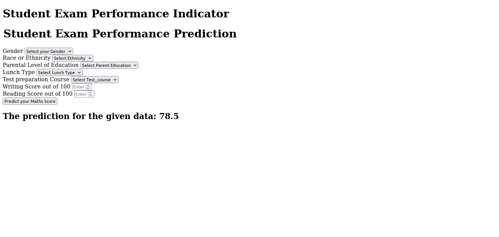

## Student Performance Analysis Prediction Project

This is an complete MLOps and Data Science project which aims to do analysis on student's performance in mathematics' exam based on various parameters such as: Gender, Test prepration, Reading and Writing scores, Race ethinicity, Parental education level etc.

### Methodology

##### 1. Exploratory Data Analysis

Firstly, I explored the dataset to understand the most important parameters that directly impact the student's performance. This was done by:

1. Filling up the missing values
2. Removing the duplicate values
3. Understanding the statistics of the whole dataset

For each of the features, Univariate, Bivariate and Multivariate analysis was done to see how does one features is related to the other or if there was any relation with other features at all.

These were the important things that were captured after the analysis:

- Student's Performance is related with lunch, race, parental level education
- Females lead in pass percentage and also are top-scorers
- Student's Performance is not much related with test preparation course
- Finishing test preparation is recommended.

##### 2. Model Training

I have implemented various supervised machine learning models to see which model perform the best with good accuracy:

    1. Random Forest Regressor
    2. Decision Tree Regressor
    3. Linear Regression
    4. XGBRegressor
    5. AdaBoost Regressor
    6. Linear Regression
    7. K-Neighbour Regressor

### Requirements

1. Create a conda environment.

2. Install the required packages from **requirements.txt** file.

```
pip install -r requirements.txt
```

### Running the application:

Navigate to the project directory and run the script:

```
python app.py
```

This will run the application where user can select among various features to get the prediction.

#### Snapshot the application:

The application in local host: http://127.0.0.1:5000/




### Results

Following are the results from the trained models:

```
Linear Regression
Model performance for Training set
- Root Mean Squared Error: 5.3231
- Mean Absolute Error: 4.2667
- R2 Score: 0.8743
----------------------------------
Model performance for Test set
- Root Mean Squared Error: 5.3940
- Mean Absolute Error: 4.2148
- R2 Score: 0.8804
===================================


Lasso
Model performance for Training set
- Root Mean Squared Error: 6.5938
- Mean Absolute Error: 5.2063
- R2 Score: 0.8071
----------------------------------
Model performance for Test set
- Root Mean Squared Error: 6.5197
- Mean Absolute Error: 5.1579
- R2 Score: 0.8253
===================================


Ridge
Model performance for Training set
- Root Mean Squared Error: 5.3233
- Mean Absolute Error: 4.2650
- R2 Score: 0.8743
----------------------------------
Model performance for Test set
- Root Mean Squared Error: 5.3904
- Mean Absolute Error: 4.2111
- R2 Score: 0.8806
===================================


K-Neighbors Regressor
Model performance for Training set
- Root Mean Squared Error: 5.7093
- Mean Absolute Error: 4.5175
- R2 Score: 0.8554
----------------------------------
Model performance for Test set
- Root Mean Squared Error: 7.2479
- Mean Absolute Error: 5.6320
- R2 Score: 0.7841
===================================


Decision Tree
Model performance for Training set
- Root Mean Squared Error: 0.2795
- Mean Absolute Error: 0.0187
- R2 Score: 0.9997
----------------------------------
Model performance for Test set
- Root Mean Squared Error: 7.9357
- Mean Absolute Error: 6.2350
- R2 Score: 0.7412
===================================


Random Forest Regressor
Model performance for Training set
- Root Mean Squared Error: 2.3212
- Mean Absolute Error: 1.8441
- R2 Score: 0.9761
----------------------------------
Model performance for Test set
- Root Mean Squared Error: 5.9768
- Mean Absolute Error: 4.6327
- R2 Score: 0.8532
===================================


XGBRegressor
Model performance for Training set
- Root Mean Squared Error: 1.0073
- Mean Absolute Error: 0.6875
- R2 Score: 0.9955
----------------------------------
Model performance for Test set
- Root Mean Squared Error: 6.4733
- Mean Absolute Error: 5.0577
- R2 Score: 0.8278
===================================


AdaBoost Regressor
Model performance for Training set
- Root Mean Squared Error: 5.9324
- Mean Absolute Error: 4.8115
- R2 Score: 0.8439
----------------------------------
Model performance for Test set
- Root Mean Squared Error: 6.1111
- Mean Absolute Error: 4.7537
- R2 Score: 0.8465
===================================

```
